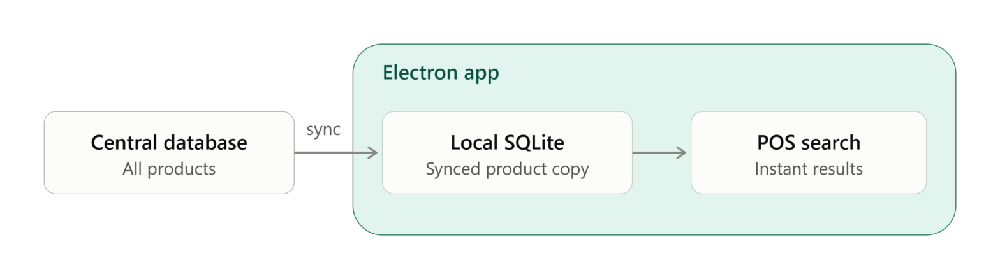
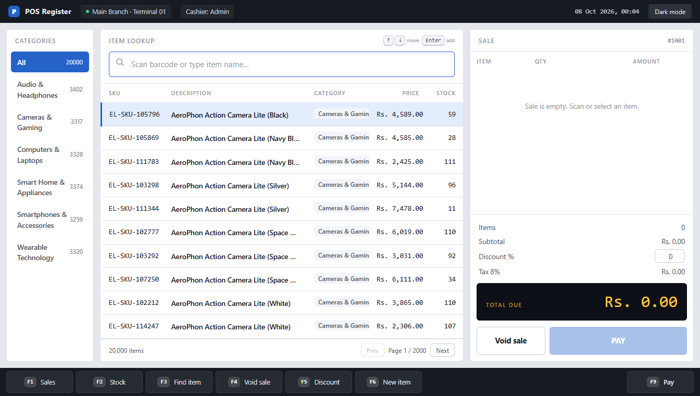

# OpenPOS

A demo Point of Sale (POS) desktop app built for **Heft Tech**.

It lets a cashier search products, build a cart, take payment, and manage stock — all from one simple screen.

## Features

- **Sales screen** — browse items by category, search by name/SKU/barcode, and build a cart
- **Live cart** — add/remove items, change quantity, apply a discount %, auto tax calculation
- **Payment** — pay by Cash, Card, or Wallet/QR, with a cash keypad and change calculator
- **Receipt** — printable receipt after every sale
- **Stock view** — see total items, units on hand, stock value, low-stock and out-of-stock counts
- **Receive stock** — add more quantity to any product directly from the stock table
- **Add new item** — create a new product on the fly
- **Keyboard shortcuts** — F1 Sales, F2 Stock, F3 Find item, F4 Void sale, F5 Discount, F6 New item, F9 Pay
- **Light / Dark mode**

## Why it's fast

Product search feels instant because the app does **not** search over the network every time.



- The **central database** holds the full product catalog (all branches, all stock).
- The app keeps a **synced copy** of that data in a local SQLite database on the device.
- Every search, filter, and page load in the app reads from this **local copy**, not the internet.
- This means searching through thousands of products returns results instantly, even with a slow or no internet connection.
- The local copy stays in sync with the central database in the background.

## Screenshots

**Sales screen**



**Stock screen**


## Project Setup

### Install

```bash
npm install
```

### Development

```bash
npm run dev
```

### Build

```bash
# For windows
npm run build:win

# For macOS
npm run build:mac

# For Linux
npm run build:linux
```
